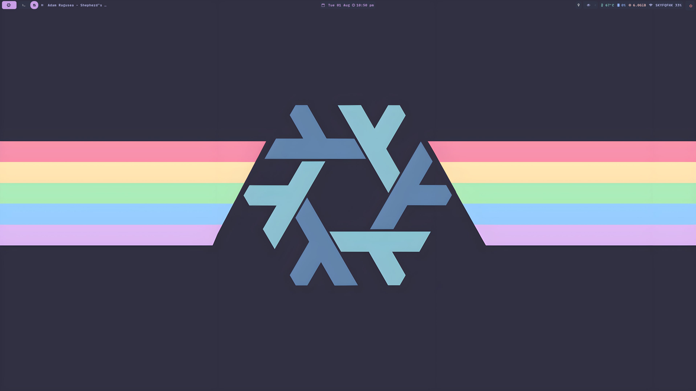
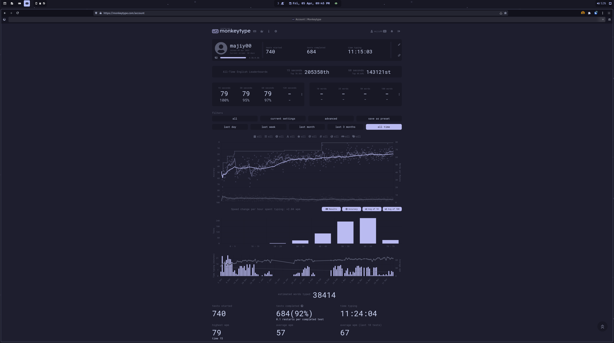

██████╗░░█████╗░████████╗███████╗██╗██╗░░░░░███████╗░██████╗
██╔══██╗██╔══██╗╚══██╔══╝██╔════╝██║██║░░░░░██╔════╝██╔════╝
██║░░██║██║░░██║░░░██║░░░█████╗░░██║██║░░░░░█████╗░░╚█████╗░
██║░░██║██║░░██║░░░██║░░░██╔══╝░░██║██║░░░░░██╔══╝░░░╚═══██╗
██████╔╝╚█████╔╝░░░██║░░░██║░░░░░██║███████╗███████╗██████╔╝
╚═════╝░░╚════╝░░░░╚═╝░░░╚═╝░░░░░╚═╝╚══════╝╚══════╝╚═════╝░


<div align="center">
  <h1> Haseeb's Dot Files :house_with_garden:</h1>
  <a href="https://git.io/typing-svg"></a>
</div>

## 👥 Install

> :fire: I wouldn't recommend just blinding using my dotfiles. They are setup for my specific use-case.
I think you're off using this repo as reference to create your own dotfiles.

```bash
git clone git@github.com:hmajid2301/dotfiles.git ~/dotfiles/
cd dotfiles

nix develop

# To build system configuration
sudo nixos-rebuild --flake .#framework

# To build user configuration
home-manager --flake .#framework
```

You can read more about my dotfiles and development workflows on my [blog here](https://haseebmajid.dev/series/my-development-workflow/) (#ShamelessPlug).

> Note my dotfiles are almost always changing!

## 🚀 Features

Some features of my dotfiles:

- Structured to allow multiple **NixOS configurations**, including **desktop**, **laptop**
- **Declarative** config including **themes**, **wallpapers** and **nix-colors**
- **Opt-in persistance** through impermanence + blank snapshot
 - Delete files on boot
- **Encrypted btrfs partition** 
- **sops-nix** for secrets management
- Different environments like **hyprland** and **gnome**
- Laptop setup with eGPU and **vfio** for playing games on windows

| Type           | Program      |
| :------------- | :----------: |
| OS             | [NixOS](https://nixos.com/) |
| Editor         | [NeoVim](https://neovim.io/) (LazyVim) |
| Prompt         | [Starship](https://starship.rs/) |
| Launcher       | [Rofi](https://github.com/davatorium/rofi) |
| Shell          | [Fish](https://fishshell.com/) |
| Status Bar     | [Waybar](https://github.com/Alexays/Waybar) |
| Terminal       | [Alacritty](https://github.com/alacritty/alacritty) |
| Window Manager | [Hyprland](https://hyprland.org/) |
| Fonts          | [Mono Lisa](https://www.monolisa.dev/) |
| Colorscheme    | [Catppuccin](https://github.com/catppuccin) |


## 🏠 Structure

- `flake.nix`: Entrypoint for hosts and home configurations
- `nixos`: 
  - `global`: Configurations that are globally applied to all my machines
  - `optional`: Configurations that some of my machines use
- `hosts`: NixOS Configurations, accessible via `nixos-rebuild --flake`.
  - `framework`: Framework 12th gen laptop | Hyprland | eGPU 3080
  - `mesmer`: Desktop AMD Ryzen 9 5950X  | Hyprland | GPU 7900 XTX
- `home-manager`: Most of my dotfiles configuration, user specific

## 🔌 Devices

Here is a list of the devices this repo is used to configure.


### 💻 Framework


This is my 12th gen Intel framework laptop. Which also can use a eGPU with VFIO (gpu passthrough).
For gaming in a Windows 11 VM setup with libvirt/qemu.

### 💻 Mesmer


This is my Desktop using a Ryzen AMD CPU and an AMD GPU. This is my main development machine
at the moment.

## Applications

I basically just installed every package from [Modern Unix](https://github.com/ibraheemdev/modern-unix).

CLI tools that I use often include:

- [fzf](https://github.com/junegunn/fzf): Fuzzy search tool
  - Especially for reverse search in my terminal with [fish shell](https://github.com/PatrickF1/fzf.fish)
- [zoxide](https://github.com/ajeetdsouza/zoxide): Smarter cd tool, integrated well with fzf, nvim and tmux
- [exa](https://github.com/ogham/exa): A replacement for `ls` with better syntax highlighting
- [ripgrep](https://github.com/BurntSushi/ripgrep): A faster `grep`
- [navi](https://github.com/denisidoro/navi): Interactive cheat sheet

### Tmux

I manage my projects using tmux sessions with the [tmux smart session manager](https://github.com/joshmedeski/t-smart-tmux-session-manager).

Where I create a new session for each project I'm working on and then jump between them.
Where a project might be:

- My Blog
- My Dotfiles
- Full stack application
  - A window for each project i.e. GUI and API


## Screenshots






## Appendix

- <a href="https://www.flaticon.com/free-icons/dot" title="dot icons">Dot icons created by Roundicons - Flaticon</a>

### Inspired By

- https://github.com/Misterio77/nix-config (Heavily!)
- https://github.dev/yurihikari/garuda-sway-config (mostly scripts)
